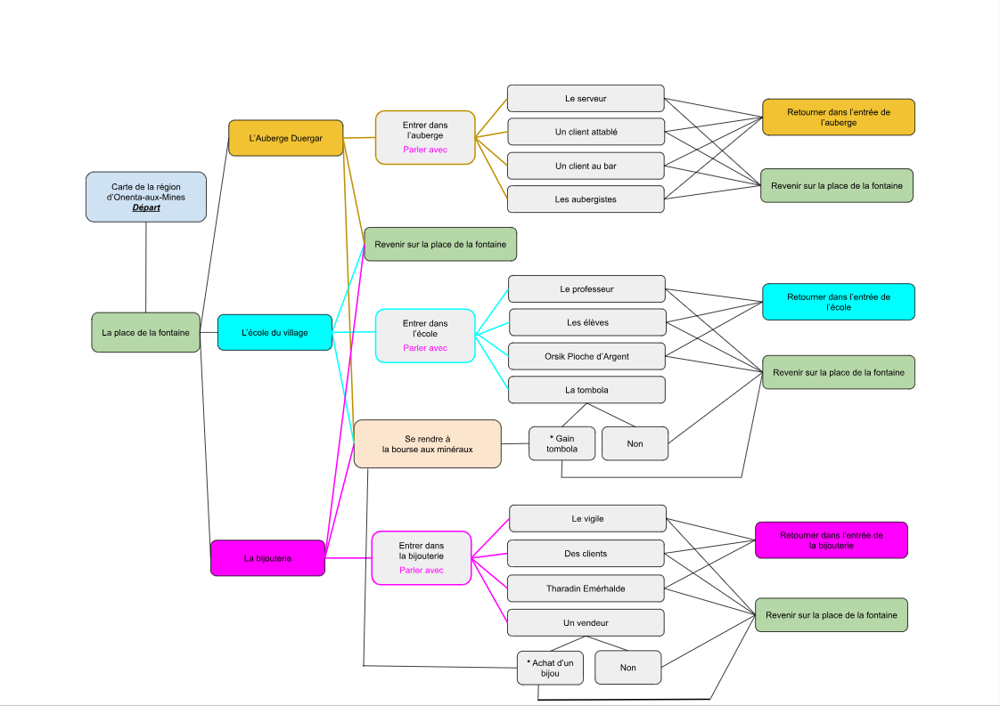
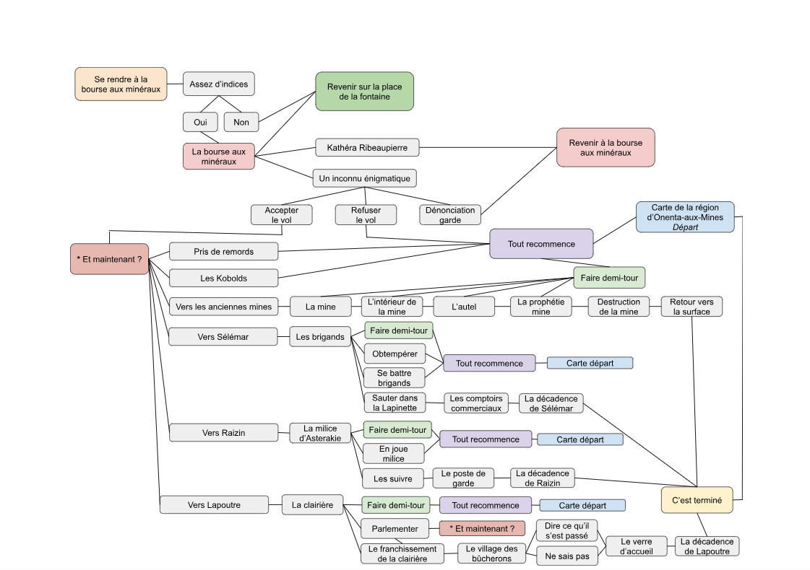
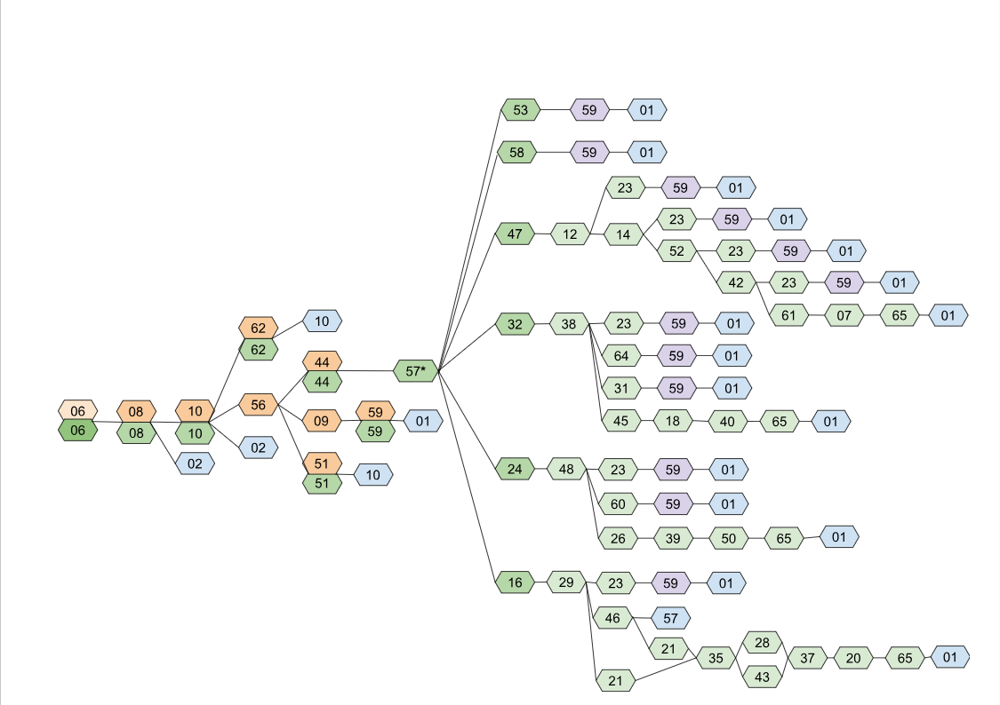

## Graphiques en arborescence représentant le schéma narratif de la partie _Livre dont vous êtes le héros_ de Fragment

Voici un fichier qui reprend mes schémas finaux de l'arborescence, afin d'avoir une vue schématique visuelle et compréhensible sans devoir parcourir au préalable la base de données pour en comprendre la structure.

Ils se présentent sous deux formes :

- Une arborescence avec un graphique textuel reprenant les titres des différents chapitres.
- Une arborescence avec un graphique numéroté correspondant aux numéros des titres des chapitres.

Chacun comprend deux images, la première représente l'acte 1 et la deuxième prend en compte les actes 2 et 3.  
J'ai également mis un astérisque `*` indiquant les chapitres permettant l'obtention d'un fragment.

Voici une description de mes graphiques car pour des raisons d'accessibilité, je ne peux pas insérer de balise `<alt>` pour décrire mes différents schémas, ceux-ci étant des captures d'écran.

#### - Les graphiques textuels :

Au nombre de deux, ils sont intitulés : "graph_title_text_act_1" et "graph_title_text_act_2_and_3".

Ces images affichent le cheminement de Fragment à travers les titres des chapitres tels que nommés dans la base de données.  
La taille de police retenue pour les textes est de 9.5 puisque les actes 2 et 3 étant trop denses pour augmenter cette taille sans tout décaler. Afin de rester cohérente entre les deux graphiques, j'ai décidé d'abaisser la taille de police de l'acte 1 à celle des actes 2 et 3.

Il y a également un code couleur :

- Dans l'acte 1, il permet de visualiser les trois grands blocs de possibilités (l'auberge, l'école, la bijouterie) ainsi que les choix qu'ils permettent.
- Dans l'acte 2, à partir de "La bourse aux minéraux", il permet de visualiser plus facilement les chapitres dits de basculement.

#### - Les graphiques numérotés :

Au nombre de deux, ils sont intitulés : "graph_number_title_act_1" et "graph_number_title_act_2_and_3".

Ces graphiques reprennent l'arborescence de Fragment à partir des numéros de chapitres correspondant aux titres de ces derniers.  
Certains chapitres apparaissent numérotés deux fois, l'un sous l'autre et avec un code couleur spécifique, ce sont des chapitres qui contiennent une version de texte "normal" (en orange) et une version de texte de type "folie" (en vert).  
Il y a aussi des chapitres en violet permettant de boucler, et en bleu permettant de terminer les arcs.

---

### Arborescence graphiques textuels :

  

---

### Arborescence graphiques numérotés :

  

