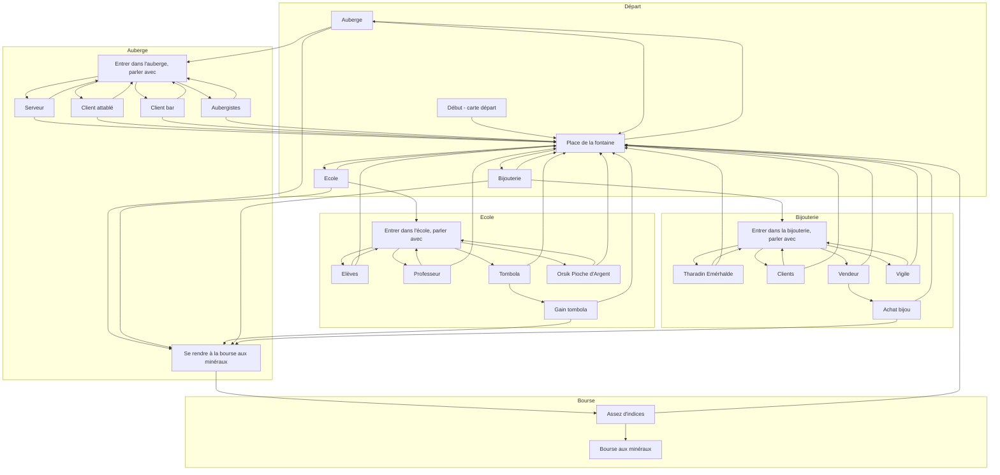
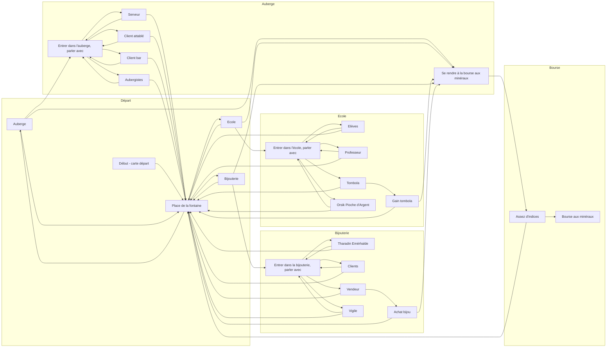

### Test pour visualiser mon arborescence de la partie Livre avec Mermaid

Ce fichier contient deux essais d'affichage de l'acte 1 avec Mermaid, qui permet un rendu sous forme graphique dans GitHub.
J'ai testé le rendu sur le site "mermaid.live.editor", mais je trouve les schémas peu lisibles.  
Pour cette raison, je laisserai mon code dans ce fichier de test, entouré par les balises HTML ```<pre> <code>` car cela deviens du coup aussi partie de mon projet.  
L'arborescence finale sera présentée via des fichiers images importés.

<br>
##### Ce graphique s'affiche de haut en bas, indiquer avec _graph TD_.

<pre><code>


</code></pre>

---
<br>  
##### Ce graphique s'affiche de gauche à droite, indiquer avec _graph LR_.

<pre><code>


</code></pre>
